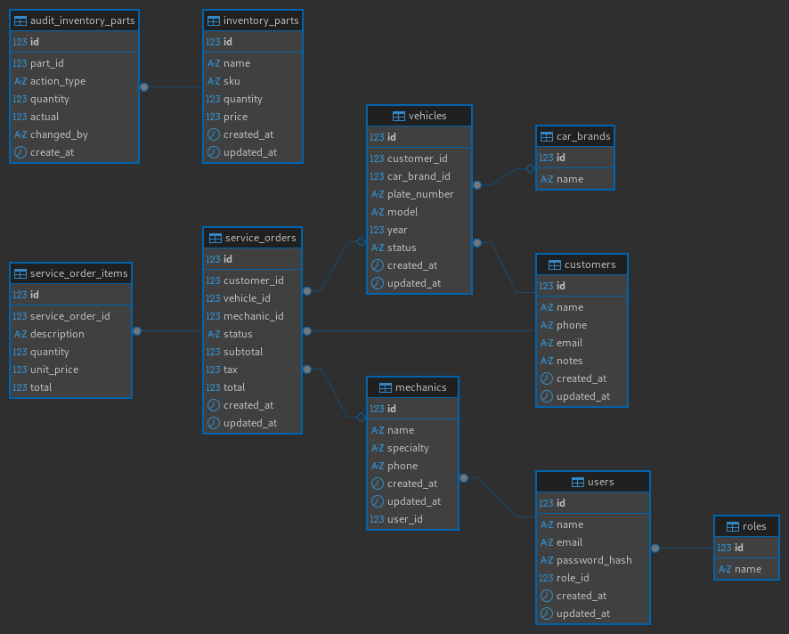

# Mechanical Workshop Management System

A pure OOP PHP 8+ workshop ERP using MVC, repository/service pattern, PDO, Bootstrap 5, SCSS, and Docker.

## Quick Start

1. Copy `.env.example` to `.env`.
2. Run `docker compose up --build -d`.
3. Run `docker compose exec php composer install`.
4. Import `database/migrations/001_schema.sql` into MySQL.
5. Open `http://localhost:8080`.

## Features

- Session authentication with role checks
- Admin middleware protection
- Bootstrap 5 dashboard skeleton
- Repository + service layer architecture
- SCSS assets and Dockerized environment

## UML

NOT FINISH YET! Changes will be made

